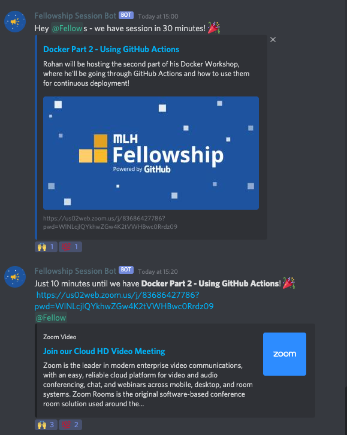

# Session Bot

Discord bot that announces upcoming sessions on the Additional Fun & Educational Events calendar!

Inspired by the [Hack Quarantine](https://hackquarantine.com) [Calendar Bot](https://github.com/HackQuarantine/calendar-bot) used to automatically make announcements from their calendar.




## Setup

Make sure to set your Google Calendar to the same timezone as the Discord Bot. In this case, it's the timezone of the Compute Engine on Google Cloud.
**TODO** document makefile and build-config.sh

- save service account creds in `credentials.json`

- create a list of Discord roles to be mentioned in `roles.json`

```json
[
    "742344995412347915",
    "742344995412347916",
    "742344995412347917"
]
```

- set environment variables
```bash
export GUILD_ID=123456789101112131 # your guild
export EVENTS_ID=123456789101112132 # the channel to post announcements in
export TOKEN=my.discord.token # your bots token
export GCAL_ID=my-super-interesting-calendar@group.calendar.google.com # your calendars ID
export UPDATE_INTERVAL=60 # check for events and update status every minute
```
> This can also be defined At the top of the [Makefile](./Makefile) in the form:
> GUILD_ID := 123456789101112131

## Run

To run the bot using your current python use:
```bash
make run
```

### Docker

To build, run and view the logs, simply run:
```bash
make docker-log
```

Alternatively build and run with `docker-compose`:

```bash
docker-compose build
docker-compose up -d
docker-compose logs -f
```
